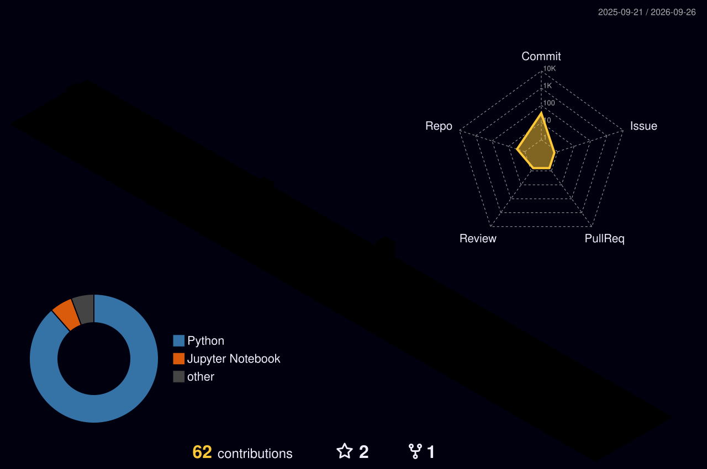

  

## Servus 👋

# 💫 Über mich:
Ich bin tief leidenschaftlich und begeistert von der Welt der KI und des Deep Learnings. Meine Reise begann mit einem starken Interesse an der Informatik und entwickelte sich zu einer tiefen Leidenschaft für die Entwicklung komplexer Algorithmen und das Verstehen neuronaler Netzwerke. Was mich an diesem Feld am meisten fasziniert, ist seine unglaubliche Fähigkeit, die Art und Weise, wie wir Menschen mit Computern interagieren und wie Computer die Welt um uns herum verstehen, grundlegend zu verändern. Das Entwerfen, Entwickeln und Optimieren von Modellen des maschinellen Lernens und das Forschen an neuen Ansätzen in der KI sind meine Kernbeschäftigungen, die mich täglich inspirieren und motivieren.

  

### Causal Multi-Head Self-Attention

### Sparse Mixture-of-Experts Routing

  

# 💻 Tech Stack:
                                

  

# 📊 GitHub Stats

 

  

### 🐍 Contribution Snake

  <picture>
    <source media="(prefers-color-scheme: dark)"  srcset="profile/snake-dark.svg"/>
    <source media="(prefers-color-scheme: light)" srcset="profile/snake-light.svg"/>
    
  </picture>

  

### 🏙️ 3D Contribution Calendar

  

  

  Stats refresh daily · Powered by GitHub Actions

